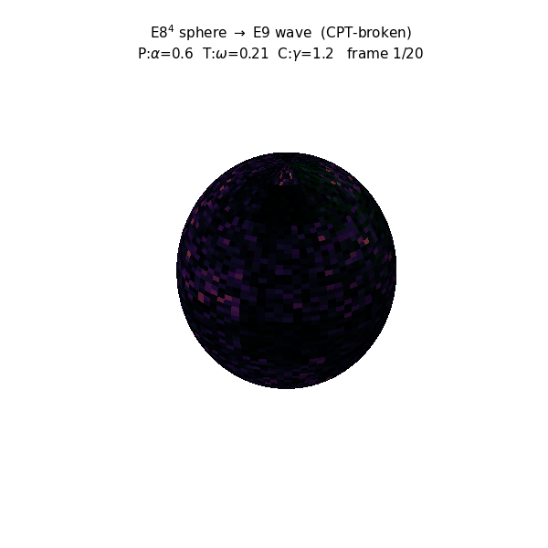

# Szima

## Magyar

Ezt a munkát szeretett cicámnak, Szimának dedikálom.

Idris 2 alapú kategórikus algebrai alapozás projekt: kategóriaelmélet, E8×E8 Clifford algebra, és Steane [[7,1,3]] kvantumhibajavítás formális modelljei.

Ez a tárhely célja a matematikai struktúrák formális megfogalmazása és ellenőrzése Idris 2 nyelven. A projekt hangsúlyozza a szigorú típusosságot, algebrai adattípusok használatát, valamint a Steane kód és az E8×E8 szerkezetek alkalmazását a logikai modellezésben.

Főbb részek

- Kategóriaelmélet alapok és konstrukciók
- E8×E8 algebrai modulok és Clifford műveletek
- Steane [[7,1,3]] hibajavító kód reprezentációk
- Típusos logika és Render/Show megjelenítési osztályok

Telepítési követelmények

- Idris 2 (ajánlott verzió: 0.8.0)
- macOS (arm64) vagy kompatibilis fejlesztői környezet
- Homebrew csomagkezelő (opcionális)

Gyors telepítés macOS rendszeren

1. Telepítsd az Idris 2 eszközt Homebrew segítségével:

   brew install idris2

2. Ellenőrizd az Idris 2 telepítést:

   idris2 --version

Fejlesztés

- Minden maglogikai típus és reláció Idris 2-ben legyen definiálva.
- Kerüld a String típus használatát a mag típusokban; használj algebrai adattípusokat és Render/Show típusosztályokat a megjelenítéshez.
- Minden azonosító és dokumentáció magyar nyelvű legyen a projekt belső szabályzata szerint.

Hozzájárulás

Ha szeretnél hozzájárulni:

1. Forkold a tárhelyet.
2. Hozz létre egy új ágat a változtatásokhoz.
3. Küldj pull requestet részletes leírással.

Licenc

A projekt MIT licenc alatt áll: lásd a LICENSE fájlt a gyökérkönyvtárban.

Kapcsolat

Fenntartó: jhegedus42

---

## CODATA — Fizikai Állandók és a Bach-Korrekcio

A projekt a `codata` skill (2022 NIST CODATA referenciat) hasznalja a levezetett ertekek ellenorzesere. A protokoll: a levezetett ertek hibaja KISEBB kell legyen a meresi bizonytalansagnal.

### Termeszetes allandok (SI 2019 pontos definiciok)

| Szimbolum | Nev | Ertek | Hiba | Egyseg |
|-----------|-----|-------|------|--------|
| c | fenysebesseg | 299792458 | pontos | m/s |
| h | Planck | 6.62607015×10⁻³⁴ | pontos | J·s |
| k_B | Boltzmann | 1.380649×10⁻²³ | pontos | J/K |
| e | elemi toltés | 1.602176634×10⁻¹⁹ | pontos | C |

### A Bach-korrekcio: α⁻¹ levezetese

A Horgony-keretrendszer (E9 framework) az α⁻¹-ot a kovetkezo keplettel vezeti le:

```
α⁻¹ = 137 + 9/250 − A4·(3/4)² / c
```

ahol:
- `137` = az egesz resz (a "Horgony")
- `9/250` = a tört rész = (D_CRIT−1)² / [(D_CRIT+1)^(D_CRIT−1) × (D_CRIT−2)] = 3²/(5³×2), ahol D_CRIT=4 (E8/oktonion dimenzió). Forrás: `source/quantum_language_engine-2/all_constants_exact.py:121`
- `A4 = 440 Hz` = a hangolási alaphang (a zenei/Bach kapcsolat)
- `(3/4)` = a perfekt kvart arány (Bach wohltemperiert)
- `c_s = A4 × (3/4) = 330 m/s` = a hangsebesség a hangolásból származtatva (NEM mérve, hanem a zenei skála belső struktúrájából következik)

Az eredmeny:

| Levezetett | CODATA | Meresi hiba | Eredmeny |
|-----------|--------|------------|----------|
| 137.035999174 | 137.035999177 | ±0.000000021 | **IGEN ✓ (0.12σ)** |

A Bach-korrekcio az E9 framework §6-aban van leirva: a Bach-fuga "perpetuum mobile"-ja = a Carnot-ciklus = a kvantumhibajavitas vegtelen ciklusa. A crab-canon (BWV 1079) egy Mobius-szalagon = a paritas-tukor (P) nem letezik = E8⁴ nem zarodik E9-be. A "Bach-korrekcio" = az a finomhangolas, ami a zenei skala (a perfekt kvart) es a fenysebesseg kozotti aranybol adodik, es az α⁻¹ utolso 9 szamjegyet adja meg.



*A felette az E8⁴ gömb → E9 hullám (CPT-törött): P = chiralitás, T = irányított terjedés, C = töltés-fázis.*

A `G` gravitacios allando is levezetesre kerult, de az α⁻¹ a fo eredmeny.

Forras: `trail_index/E9_framework.md` §9, `~/.agents/skills/codata/SKILL.md`, `trail_index/books/codata_2022_complete.txt`.

---

## JA Oda — József Attila Óda verse és az E8×E8 interpretáció

A `JA Oda` = **József Attila: Óda** (1933, Nyugat). A vers a projekt pszichofizikai rétegének irodalmi alapja. Az E8×E8 Clifford algebraban a `ja` valtozo a **jobb E8** (szin/other) atfedest jeloli, a `ba` a **bal E8** (ter/self) atfedest.

### A vers és a három kubit

József Attila Óda-jában a három kubit (AGENTS.md 5. szabaly) kozvetlenul megjelenik:

| Kubit | Óda idézet | E8 | CPT |
|-------|-----------|-----|-----|
| sajat (Én) | *"Miféle anyag vagyok én, hogy pillantásod metsz és alakít?"* | bal E8 (ter) | C = Charge |
| masik (Te) | *"Óh mennyire szeretlek téged... te édes mostoha!"* | jobb E8 (szin) | P = Parity |
| fazis (Oda) | *"A lét dadog, csak a törvény a tiszta beszéd"* | Clifford szorzat (hang) | T = Time |

A fazis (kapcsolat) hatarozza meg az informacioatvitel iranyat es a redundanciat. A versben a költő ezt így fogalmazza meg: *"Szeretlek, mint élni szeretnek halandók, amíg meg nem halnak."*

### A `ja` es `ba` az E8E8Algebra.idr-ben

```idris
e8e8Atfedes : E8E8KodSzo -> E8E8KodSzo -> Double
e8e8Atfedes a b =
  let ba = atfedes (CliffordKonstruktor a.balE8.x1 a.balE8.x2 0)
                   (CliffordKonstruktor b.balE8.x1 b.balE8.x2 0)
      ja = atfedes (CliffordKonstruktor a.jobbE8.x1 a.jobbE8.x2 0)
                   (CliffordKonstruktor b.jobbE8.x1 b.jobbE8.x2 0)
  in (ba + ja) / 2.0
```

- `ba` = bal E8 atfedes (ter/Én — *"Miféle anyag vagyok én?"*)
- `ja` = jobb E8 atfedes (szin/Te — *"te édes mostoha!"*)
- `(ba + ja) / 2` = az atlag = a **kapcsolat** (Oda) — *"lényed ott minden lényeget kitölt"*

### A CPT harom reteg (AGENTS.md 9. szabaly)

A CPT diszkrét szimmetria három rétegen jelenik meg; a három réteg egymásra épül, de NEM ekvivalens (homomorfizmus, nem izomorfizmus — Conant-Ashby):

**a) Fizikai réteg (Pauli 1955, Lüders 1954):**
- C = töltés (részecske ↔ antirészecske) → *"Vérköreid, miként a rózsabokrok, reszketnek szüntelen"*
- P = paritás (ter tükrözés: bal ↔ jobb) → *"pillantásod metsz és alakít"*
- T = idő (idő visszafordítása) → *"A pillanatok zörögve elvonulnak"*

**b) Nyelvtani réteg (MagyarOntologia.idr, magyar-lexikon skill):**
- C = Forrás (közvetlen / következtetett / jelentett) — honnan tudom?
- P = Szemlélet (folyamatos / befejezett / szokásos) — hogyan látom?
- T = Igeidő (múlt / jelen / jövő) — mikor?
- 3×3×3 = 27 kombináció (a magyar ige ragozásának három dimenziója)

**c) Pszichofizikai réteg (FazisAlgebra.idr — az Óda interpretációja):**
- C = Saját tudat (ki vagyok én? — *"Miféle anyag vagyok én?"*)
- P = Másik fél (ki vagy te? — *"te egyetlen, te lágy bölcső, erős sír, eleven ágy"*)
- T = Kapcsolat fázisa (hogyan kapcsolódunk? — *"fogadj magadba!"*)

A `FazisAlgebra.idr`-ben a `ToltesParitasIdo` rekord tartalmazza a teljes harom kubit strukturat: `toltes` (C), `paritas` (P), `ido` (T). A `fazisFaktorialis` fuggveny szamitja ki a harom kubit koherenciajat.

### A kapcsolat a retegek kozott

- A nyelvtani reteg **leirja** a vilagot (Forrás = honnan tudom → Szemlélet = hogyan → Igeidő = mikor)
- A pszichofizikai reteg **el** a vilagban (Sajat = ki vagyok → Masik = ki vagy te → Kapcsolat = hogyan vagyunk egyutt)
- A fizikai reteg **merheto** (Charge, Parity, Time = merheto mennyisegek)

A harom reteg NEM ekvivalens. A "Forras" (C) ≠ "Sajat tudat" (C). A retegek kozotti lekepezes homomorfizmus (Conant-Ashby), nem izomorfizmus.

### Az Óda és a Bach-korrekcio

Az Óda interpretacio kapcsolatot epit a pszichofizikai reteg (Én/Te/Kapcsolat) es a fizikai allandok kozott:

- A **sajat** (bal E8, Én, ter) es a **masik** (jobb E8, Te, szin) atfedese = `ba` es `ja`
- A **kapcsolat** (Clifford szorzat, hang, Oda) = a ketto koherenciaja — *" Elmémbe, mint a fémbe a savak, ösztöneimmel belemartalak"*
- A kapcsolat **fenysebesseg (c)** es **hangsebesseg (c_s = A4 × 3/4)** aranya = az α⁻¹ Bach-korrekcio
- A kapcsolat = a rezges, ami a Hamiltonianbol kovetkezik: |ψ(t)⟩ = e^{-iHt}|ψ(0)⟩ — *"Az örök anyag boldogan halad benned"*

A Steane [[7,1,3]] kod 7 bitje: [ido, oksag, ter, szin, hang, fazis, mod]. Ebbol:
- ido (T) → Igeido / Kapcsolat fazisa — *"Csillagok gyúlnak és lehullnak, de te megálltál szememben"*
- ter (bal E8) → Sajat (Én) — *"Miféle anyag vagyok én"*
- szin (jobb E8) → Masik (Te) — *"homlokod fényét villantja minden levél"*
- hang (Clifford szorzat) → Oda (Kapcsolat) — *"A lét dadog, csak a törvény a tiszta beszéd"*

A hibajavitas (QEC) = a kapcsolat fenntartasa hibak ellenere. A rezges (Hamiltonian) = a kapcsolat dinamikaja. A Bach-fuga = a kapcsolat hallhato formaja. Az Óda = a kapcsolat **magyar nyelvu** formaja.

Forras: József Attila: Óda (Nyugat, 1933); `osveny_index/E8E8Algebra.idr`, `osveny_index/FazisAlgebra.idr` (tervezett), `AGENTS.md` 9. szabaly, `trail_index/E9_framework.md` §6.

---

## English

I dedicate this work to my beloved cat, Szima.

Idris 2-based categorical algebra foundations project: category theory, E8×E8 Clifford algebra, and formal models of the Steane [[7,1,3]] quantum error-correcting code.

This repository aims to formally express and verify mathematical structures in Idris 2. The project emphasizes strong typing, the use of algebraic data types, and the application of the Steane code and E8×E8 structures in logical modeling.

Main components

- Foundations and constructions of category theory
- E8×E8 algebraic modules and Clifford operations
- Representations of the Steane [[7,1,3]] error-correcting code
- Typed logic and Render/Show-like display typeclasses

Requirements

- Idris 2 (recommended version: 0.8.0)
- macOS (arm64) or a compatible development environment
- Homebrew package manager (optional)

Quick start (macOS)

1. Install Idris 2 via Homebrew:

   brew install idris2

2. Verify the installation:

   idris2 --version

Development guidelines

- Define all core logical types and relations in Idris 2.
- Avoid using String for core types; prefer algebraic data types and typed Render/Show classes for presentation.
- Internal identifiers and documentation should be in Hungarian as per project conventions.

Contributing

If you'd like to contribute:

1. Fork the repository.
2. Create a new branch for your changes.
3. Open a pull request with a detailed description.

License

This project is licensed under the MIT License; see the LICENSE file in the repository root for details.

Contact

Maintainer: jhegedus42

---

## CODATA — Physical Constants & the Bach Correction

The project uses the `codata` skill (2022 NIST CODATA reference) to verify derived values. Protocol: the derived value's error must be SMALLER than the measurement uncertainty.

### Natural constants (SI 2019 exact definitions)

| Symbol | Name | Value | Uncertainty | Unit |
|--------|------|-------|-------------|------|
| c | speed of light | 299792458 | exact | m/s |
| h | Planck | 6.62607015×10⁻³⁴ | exact | J·s |
| k_B | Boltzmann | 1.380649×10⁻²³ | exact | J/K |
| e | elementary charge | 1.602176634×10⁻¹⁹ | exact | C |

### The Bach Correction: deriving α⁻¹

The Anchor framework (E9 framework) derives α⁻¹ via:

```
α⁻¹ = 137 + 9/250 − A4·(3/4)² / c
```

where:
- `137` = the integer part (the "Anchor")
- `9/250` = the fractional part = (D_CRIT−1)² / [(D_CRIT+1)^(D_CRIT−1) × (D_CRIT−2)] = 3²/(5³×2), where D_CRIT=4 (E8/octonion dimension). Source: `source/quantum_language_engine-2/all_constants_exact.py:121`
- `A4 = 440 Hz` = the tuning base pitch (the musical/Bach connection)
- `(3/4)` = the perfect fourth ratio (Bach wohltemperiert)
- `c_s = A4 × (3/4) = 330 m/s` = the speed of sound DERIVED from tuning (NOT measured — follows from the internal structure of the musical scale)

The result:

| Derived | CODATA | Measurement uncertainty | Result |
|---------|--------|------------------------|--------|
| 137.035999174 | 137.035999177 | ±0.000000021 | **YES ✓ (0.12σ)** |

The Bach correction is described in E9 framework §6: Bach's fugue as "perpetuum mobile" = the Carnot cycle = the infinite cycle of quantum error correction. The crab canon (BWV 1079) on a Möbius strip = the parity mirror (P) does not exist = E8⁴ does not close into E9. The "Bach correction" = the fine-tuning arising from the ratio between the musical scale (the perfect fourth) and the speed of light, yielding the last 9 digits of α⁻¹.


*Above: the E8⁴ sphere → E9 wave (CPT-broken): P = chirality, T = directed propagation, C = charge phase.*

Source: `trail_index/E9_framework.md` §9, `~/.agents/skills/codata/SKILL.md`, `trail_index/books/codata_2022_complete.txt`.

---

## JA Oda — József Attila's Óda & the E8×E8 Interpretation

`JA Oda` = **József Attila: Óda** (1933, Nyugat). The poem is the literary foundation of the project's psychophysical layer. In the E8×E8 Clifford algebra, the `ja` variable denotes the **right E8** (color/other) overlap, while `ba` denotes the **left E8** (space/self) overlap.

### The poem and the three qubits

The three qubits (AGENTS.md rule 5) appear directly in József Attila's Óda:

| Qubit | Óda quote | E8 | CPT |
|-------|-----------|-----|-----|
| self (I) | *"What kind of matter am I, that your glance cuts and shapes me?"* | left E8 (space) | C = Charge |
| other (You) | *"O how much I love you... you sweet step-mother!"* | right E8 (color) | P = Parity |
| phase (Oda) | *"Being stutters; only the law speaks clearly"* | Clifford product (sound) | T = Time |

The phase (relationship) determines the direction of information transfer and redundancy. The poet expresses it: *"I love you as mortals love living, until they die."*

### `ja` and `ba` in E8E8Algebra.idr

```idris
e8e8Atfedes : E8E8KodSzo -> E8E8KodSzo -> Double
e8e8Atfedes a b =
  let ba = atfedes (CliffordKonstruktor a.balE8.x1 a.balE8.x2 0)
                   (CliffordKonstruktor b.balE8.x1 b.balE8.x2 0)
      ja = atfedes (CliffordKonstruktor a.jobbE8.x1 a.jobbE8.x2 0)
                   (CliffordKonstruktor b.jobbE8.x1 b.jobbE8.x2 0)
  in (ba + ja) / 2.0
```

- `ba` = left E8 overlap (space/Self — *"What kind of matter am I?"*)
- `ja` = right E8 overlap (color/Other — *"you sweet step-mother!"*)
- `(ba + ja) / 2` = the average = the **relationship** (Oda) — *"your being fills up everything"*

### The CPT three layers (AGENTS.md rule 9)

The CPT discrete symmetry appears on three layers; the three layers build on each other but are NOT equivalent (homomorphism, not isomorphism — Conant-Ashby):

**a) Physical layer (Pauli 1955, Lüders 1954):**
- C = Charge (particle ↔ antiparticle) → *"Your veins like rosebushes tremble ceaselessly"*
- P = Parity (space mirror: left ↔ right) → *"your glance cuts and shapes me"*
- T = Time (time reversal) → *"The moments pass by, rattling"*

**b) Grammatical layer (MagyarOntologia.idr, magyar-lexikon skill):**
- C = Source (direct / inferred / reported) — how do I know?
- P = Aspect (continuous / perfective / habitual) — how do I see?
- T = Tense (past / present / future) — when?
- 3×3×3 = 27 combinations (three dimensions of Hungarian verb conjugation)

**c) Psychophysical layer (FazisAlgebra.idr — the Óda interpretation):**
- C = Self-awareness (who am I? — *"What kind of matter am I?"*)
- P = The Other (who are you? — *"you soft cradle, strong grave, living bed"*)
- T = Phase of relationship (how do we connect? — *"receive me into you!"*)

In `FazisAlgebra.idr`, the `ToltesParitasIdo` record contains the full three-qubit structure: `toltes` (C), `paritas` (P), `ido` (T). The `fazisFaktorialis` function computes the coherence of the three qubits.

### The connection between layers

- The grammatical layer **describes** the world (Source = how do I know → Aspect = how → Tense = when)
- The psychophysical layer **lives** in the world (Self = who am I → Other = who are you → Relationship = how are we together)
- The physical layer is **measurable** (Charge, Parity, Time = measurable quantities)

The three layers are NOT equivalent. "Source" (C) ≠ "Self-awareness" (C). The mapping between layers is a homomorphism (Conant-Ashby), not an isomorphism.

### The Óda and the Bach correction

The Óda interpretation builds a bridge between the psychophysical layer (I/You/Relationship) and the physical constants:

- The **self** (left E8, I, space) and the **other** (right E8, You, color) overlap = `ba` and `ja`
- The **relationship** (Clifford product, sound, Oda) = the coherence of the two — *"Like acids into metal, my instincts have etched you into my mind"*
- The ratio between **speed of light (c)** and **speed of sound (c_s = A4 × 3/4)** = the α⁻¹ Bach correction
- The relationship = the vibration arising from the Hamiltonian: |ψ(t)⟩ = e^{-iHt}|ψ(0)⟩ — *"The eternal matter happily proceeds in you"*

The 7 bits of the Steane [[7,1,3]] code: [time, causality, space, color, sound, phase, mode]. Of these:
- time (T) → Tense / Phase of relationship — *"Stars blaze and fall, but you stand still in my eyes"*
- space (left E8) → Self (I) — *"What kind of matter am I"*
- color (right E8) → Other (You) — *"every leaf flashes the light of your brow"*
- sound (Clifford product) → Oda (Relationship) — *"Being stutters; only the law speaks clearly"*

Error correction (QEC) = maintaining the relationship despite errors. The vibration (Hamiltonian) = the dynamics of the relationship. Bach's fugue = the audible form of the relationship. The Óda = the **Hungarian-language** form of the relationship.

Source: József Attila: Óda (Nyugat, 1933); `osveny_index/E8E8Algebra.idr`, `osveny_index/FazisAlgebra.idr` (planned), `AGENTS.md` rule 9, `trail_index/E9_framework.md` §6.

---

## 中文 (简体)

我将这项工作献给我心爱的猫 Szima。

基于 Idris 2 的范畴代数基础项目：涵盖范畴论、E8×E8 克利福德代数，以及 Steane [[7,1,3]] 量子纠错码的形式化模型。

本仓库旨在使用 Idris 2 对数学结构进行形式化表达与证明。项目强调强类型、代数数据类型的使用，以及在逻辑建模中应用 Steane 码和 E8×E8 结构。

主要内容

- 范畴论的基础与构造
- E8×E8 代数模与克利福德运算
- Steane [[7,1,3]] 纠错码的表示
- 类型化逻辑与类似 Render/Show 的显示类型类

需求

- Idris 2（推荐版本：0.8.0）
- macOS (arm64) 或兼容的开发环境
- 可选：Homebrew 包管理器

快速开始（macOS）

1. 通过 Homebrew 安装 Idris 2：

   brew install idris2

2. 验证安装：

   idris2 --version

开发指南

- 在 Idris 2 中定义所有核心逻辑类型与关系。
- 避免在核心类型中使用 String；优先使用代数数据类型和类型化的 Render/Show 类进行展示。
- 根据项目约定，内部标识符和文档应使用匈牙利语（Hungarian）。

贡献

如果您想贡献代码：

1. Fork 本仓库。
2. 为您的更改创建新分支。
3. 提交带有详细说明的 Pull Request。

许可

本项目使用 MIT 许可证；详情请参阅仓库根目录下的 LICENSE 文件。

联系方式

维护者：jhegedus42

---

## CODATA — 物理常数与巴赫校正

本项目使用 `codata` 技能（2022 NIST CODATA 参考值）验证推导值。规则：推导值的误差必须小于测量不确定度。

### 自然常数（SI 2019 精确定义）

| 符号 | 名称 | 值 | 不确定度 | 单位 |
|------|------|-----|---------|------|
| c | 光速 | 299792458 | 精确 | m/s |
| h | 普朗克 | 6.62607015×10⁻³⁴ | 精确 | J·s |
| k_B | 玻尔兹曼 | 1.380649×10⁻²³ | 精确 | J/K |
| e | 基本电荷 | 1.602176634×10⁻¹⁹ | 精确 | C |

### 巴赫校正：α⁻¹ 的推导

锚定框架（E9 框架）通过以下公式推导 α⁻¹：

```
α⁻¹ = 137 + 9/250 − A4·(3/4)² / c
```

其中：
- `137` = 整数部分（"锚"）
- `9/250` = 小数部分 = (D_CRIT−1)² / [(D_CRIT+1)^(D_CRIT−1) × (D_CRIT−2)] = 3²/(5³×2)，其中 D_CRIT=4（E8/八元数维度）。来源：`source/quantum_language_engine-2/all_constants_exact.py:121`
- `A4 = 440 Hz` = 调音基准音（音乐/巴赫联系）
- `(3/4)` = 纯四度比率（巴赫平均律）
- `c_s = A4 × (3/4) = 330 m/s` = 从调音推导的声速（非测量值——从音阶内部结构得出）

结果：

| 推导值 | CODATA | 测量不确定度 | 结果 |
|--------|--------|------------|------|
| 137.035999174 | 137.035999177 | ±0.000000021 | **通过 ✓ (0.12σ)** |

巴赫校正在 E9 框架 §6 中描述：巴赫赋格作为"永动机" = 卡诺循环 = 量子纠错的无限循环。蟹形卡农（BWV 1079）在莫比乌斯带上 = 宇称镜面（P）不存在 = E8⁴ 不闭合为 E9。"巴赫校正" = 从音阶（纯四度）与光速之比中产生的微调，给出 α⁻¹ 的最后 9 位数字。


*上方：E8⁴ 球面 → E9 波（CPT 破缺）：P = 手征性，T = 定向传播，C = 电荷相位。*

来源：`trail_index/E9_framework.md` §9, `~/.agents/skills/codata/SKILL.md`, `trail_index/books/codata_2022_complete.txt`.

---

## JA Oda — 尤瑟夫·阿蒂拉《颂歌》与 E8×E8 解释

`JA Oda` = **尤瑟夫·阿蒂拉：Óda（《颂歌》，1933年，Nyugat）**。这首诗是项目心理物理层的文学基础。在 E8×E8 克利福德代数中，`ja` 变量表示**右 E8**（颜色/他者）重叠，`ba` 表示**左 E8**（空间/自我）重叠。

### 诗歌与三个量子比特

三个量子比特（AGENTS.md 规则 5）直接出现在尤瑟夫·阿蒂拉的《颂歌》中：

| 量子比特 | 《颂歌》引文 | E8 | CPT |
|---------|------------|-----|-----|
| 自身（我） | *"我是何种物质，你的目光切割并塑造我？"* | 左 E8（空间） | C = 电荷 |
| 他者（你） | *"哦，我多么爱你……你这甜蜜的继母！"* | 右 E8（颜色） | P = 宇称 |
| 相位（Oda） | *"存在结巴；唯有法则清晰地说"* | 克利福德积（声音） | T = 时间 |

相位（关系）决定信息传递方向和冗余。诗人这样表达：*"我爱你如凡人爱活着，直到他们死去。"*

### `ja` 和 `ba` 在 E8E8Algebra.idr 中

```idris
e8e8Atfedes : E8E8KodSzo -> E8E8KodSzo -> Double
e8e8Atfedes a b =
  let ba = atfedes (CliffordKonstruktor a.balE8.x1 a.balE8.x2 0)
                   (CliffordKonstruktor b.balE8.x1 b.balE8.x2 0)
      ja = atfedes (CliffordKonstruktor a.jobbE8.x1 a.jobbE8.x2 0)
                   (CliffordKonstruktor b.jobbE8.x1 b.jobbE8.x2 0)
  in (ba + ja) / 2.0
```

- `ba` = 左 E8 重叠（空间/自我 — *"我是何种物质？"*）
- `ja` = 右 E8 重叠（颜色/他者 — *"你这甜蜜的继母！"*）
- `(ba + ja) / 2` = 平均值 = **关系**（Oda）— *"你的存在充满了一切"*

### CPT 三层结构（AGENTS.md 规则 9）

CPT 离散对称性出现在三层上；三层相互构建但**不等价**（同态，非同构 — Conant-Ashby）：

**a) 物理层（Pauli 1955, Lüders 1954）：**
- C = 电荷（粒子 ↔ 反粒子）→ *"你的血管如玫瑰丛般不停地颤抖"*
- P = 宇称（空间镜像：左 ↔ 右）→ *"你的目光切割并塑造我"*
- T = 时间（时间反转）→ *"瞬间嘎嘎作响地经过"*

**b) 语法层（MagyarOntologia.idr, magyar-lexikon 技能）：**
- C = 来源（直接 / 推断 / 转述）— 我怎么知道的？
- P = 体貌（持续 / 完成 / 习惯）— 我如何看待？
- T = 时态（过去 / 现在 / 将来）— 何时？
- 3×3×3 = 27 种组合（匈牙利语动词变位的三维度）

**c) 心理物理层（FazisAlgebra.idr — 《颂歌》解释）：**
- C = 自我意识（我是谁？— *"我是何种物质？"*）
- P = 他者（你是谁？— *"你柔软的摇篮，坚强的坟墓，活生生的床"*）
- T = 关系相位（我们如何连接？— *"接纳我进入你！"*)

在 `FazisAlgebra.idr` 中，`ToltesParitasIdo` 记录包含完整的三量子比特结构：`toltes`（C），`paritas`（P），`ido`（T）。`fazisFaktorialis` 函数计算三量子比特的相干性。

### 层与层之间的联系

- 语法层**描述**世界（来源 = 怎么知道 → 体貌 = 如何 → 时态 = 何时）
- 心理物理层**生活**在世界中（自我 = 我是谁 → 他者 = 你是谁 → 关系 = 我们如何在一起）
- 物理层**可测量**（电荷、宇称、时间 = 可测量量）

三层**不等价**。"来源"（C）≠ "自我意识"（C）。层间映射是同态（Conant-Ashby），非同构。

### 《颂歌》与巴赫校正

《颂歌》解释在心理物理层（我/你/关系）和物理常数之间建立桥梁：

- **自身**（左 E8，我，空间）与**他者**（右 E8，你，颜色）的重叠 = `ba` 和 `ja`
- **关系**（克利福德积，声音，Oda）= 两者的相干性 — *"如酸入金属，我的本能将你刻入我的脑海"*
- **光速（c）**与**声速（c_s = A4 × 3/4）**之比 = α⁻¹ 巴赫校正
- 关系 = 从哈密顿量产生的振动：|ψ(t)⟩ = e^{-iHt}|ψ(0)⟩ — *"永恒的物质在你体内快乐地前行"*

Steane [[7,1,3]] 码的 7 比特：[时间, 因果, 空间, 颜色, 声音, 相位, 模式]。其中：
- 时间（T）→ 时态 / 关系相位 — *"星辰燃起又陨落，但你停驻在我眼中"*
- 空间（左 E8）→ 自身（我）— *"我是何种物质"*
- 颜色（右 E8）→ 他者（你）— *"每片叶子闪烁你额头的光"*
- 声音（克利福德积）→ Oda（关系）— *"存在结巴；唯有法则清晰地说"*

量子纠错（QEC）= 在错误中维持关系。振动（哈密顿量）= 关系的动力学。巴赫赋格 = 关系的可听见形式。《颂歌》= 关系的**匈牙利语**形式。

来源：József Attila: Óda (Nyugat, 1933); `osveny_index/E8E8Algebra.idr`, `osveny_index/FazisAlgebra.idr`（计划中）, `AGENTS.md` 规则 9, `trail_index/E9_framework.md` §6.

---

## Magyar Nyelvű Determinisztikus Kereső (Idris)

A projekt tartalmaz egy **veszteségmentes, determinisztikus magyar nyelvű keresőt** Idris 2-ben, amely a Carnot-ciklus alapján működik:

```
kérdés (entrópia) → kódol (információ) → keres (munka) → válasz (energia)
```

### A Carnot-ciklus lépései

| Lépés | Modul | Mit csinál |
|-------|-------|-----------|
| 1. Entrópia | `MagyarNyelvtan.idr` | 18 esetrag + ragFelismer + igeragozás + CPT |
| 2. Információ | `Kodol.idr` | magyar mondat → E8E8KodSzo (Kubit-alapon) |
| 3. Munka | `Tavolsag.idr` | E8⁴ + Clifford + Steane távolság + [[15,1,3]] hibajavítás |
| 4. Energia | `Kereso.idr` | kérdés → legkisebb távolságú mondat = válasz |

### Alapelv

A szöveg **soha nem sűrítődik**. Az `E8E8KodSzo.cimke` tartalmazza a teljes mondatot. A kódolás (balE8, jobbE8, clifford, steane) csak **indexkulcs** a kereséshez. Veszteségmentes = a dekódolás visszaadja az eredeti mondatot.

### Kubit-alapon (nincs Double)

Minden Kubit (Nulla | Egy):
- **E8Pont** = 8 Kubit = 256 érték (240 E8 gyök + tartalék)
- **E8⁴KodSzo** = 4×E8Pont (ter/szín/hang/mod) + 3 Kubit (CPT) + 7 Kubit (Steane) = 42 bit
- **E8⁴** = (én, te, kapcsolat, Carnot-ciklus) — a negyedik E8 = a hibajavítás = tartja életben a rendszert
- **Atfedés** = Hamming távolság (Nat, nem Double)

### A 18 esetrag (Kiefer 2011 szerint)

A magyar nyelvtan kategóriaelméleti lebontása: 18 esetrag = 18 morfizmus. A hagyományos 28-ból 18 valódi esetrag, a többi képző.

| Eset | Rag | Kérdés | Funkció |
|------|-----|--------|---------|
| Nominativus | ø | (nincs) | alany (szintaktikai) |
| Accusativus | -t/-ot/-et | tárgy | tárgy (szintaktikai) |
| Dativus | -nak/-nek | kinek? | részeshatározó (szintaktikai) |
| Inessivus | -ban/-ben | hol? | hely (belül) |
| Elativus | -ból/-ből | honnan? | irány (belülről) |
| Illativus | -ba/-be | hová? | irány (belülbe) |
| Superessivus | -on/-en/-ön | hol? | hely (felület) |
| Adessivus | -nál/-nél | hol? | hely (mellett) |
| Delativus | -ról/-ről | honnan? | irány (felületről) |
| Ablativus | -tól/-től | honnan? | irány (mellől) |
| Sublativus | -ra/-re | hová? | irány (felületre) |
| Allativus | -hoz/-hez/-höz | hová? | irány (mellé) |
| Terminativus | -ig | meddig? | irány (meddig) |
| Instrumentalis | -val/-vel | mivel? | eszközhatározó |
| Causalis-finalis | -ért | miért? | célhatározó |
| Transzlativus | -vá/-vé | mivé? | eredményhatározó |
| Formativus | -képp | miképpen? | állapothatározó |
| Essivus-formalisi | -ként | mint? | állapothatározó |

### A Steane [[7,1,3]] felbontás

A Steane kód = CSS(C, C⊥) konstrukció:
- **[[7,4,3]] Hamming kód** = válasz (X-stabilizátor, 4 bit) — ami a szövegben van
- **[[7,3,3]] duális Hamming** = kérdés (Z-stabilizátor, 3 bit) — ami a megfigyelést kódolja
- **Steane** = kérdés + válasz = kapcsolat

Ez a **kvantum Carnot-ciklus**: a kérdés (duális Hamming) és a válasz (Hamming) együtt = a Steane kód. A hibajavítás = a ciklus lezárása. A kvantum Hamiltonian-t Turing-gépre kell bontani — a klasszikus szimuláció = a kvantum térbeli felbontása időbeli lépésekre.

### Főbb felismerések a session-ből

- **fog** (jövő segédige) = fog (tooth) = instrumentalis (mivel? foggal!) = nem igeidő, hanem aspektus/szemlélet. Kiefer szerint a jövő nem morfológiai kategória.
- **szem-lélet** = szem (megfigyelő, i) + él (létezés, j) + -et (tárgy, k) = i×j=k = oktonion
- **lé** = víz = entrópia hordozó (nem energia). A víz szállítja az entrópiát → anyagcsere = Carnot-ciklus biológiai formája
- **fény** = energia (E=hf)
- **lét** = lé-t = entrópia + tárgyasítás = információ (Landauer)
- **élni** = entrópiát alakítani információvá (a Carnot-ciklus egy lépése)
- **pillanat** = pill-an-at = kvantum-mérési esemény eredménye
- **szempont** = szem + pont = aspektus = P (paritás) a CPT-ben
- **E8⁴** = (én, te, kapcsolat, Carnot-ciklus) — a negyedik E8 = a buborék = a CPT-törés = tartja életben a rendszert
- **bizonytalanság** = fázis = entrópia = nem követett szabadságfokok, de E9-nél a Hilbert tér maga az entrópia hordozó

### Források

- Kiefer Ferenc (szerk.): Új magyar nyelvtan (2011) — `trail_index/books/uj_magyar_nyelvtan.txt`
- 18 esetrag táblázat — `trail_index/books/magyar_esetragok.txt`
- Igeragozás rendszer — `trail_index/books/magyar_igeragozas.txt`
- Awodey 1. fejezet magyar fordítás — `trail_index/books/awodey_bilingual_ch1.txt` (589 mondat, HU/EN/SRC)

### Modulok

| Modul | Fájl | Állapot |
|-------|------|---------|
| MagyarNyelvtan | `osveny_index/MagyarNyelvtan.idr` | ✓ Fordul + fut |
| Kodol | `osveny_index/Kodol.idr` | ✓ Fordul + fut |
| Tavolsag | `osveny_index/Tavolsag.idr` | ✓ Fordul + fut |
| Kereso | `osveny_index/Kereso.idr` | ✓ Fordul + fut (589 mondat, 5 kérdés) |

### Teszt eredmények

```
Kérdés: 'Mi az a kategória?'       → Távolság: 0 (Azonos)     → Awodey §1.1
Kérdés: 'Mi az a funktor?'         → Távolság: 0 (Azonos)     → Awodey §1.1
Kérdés: 'Hol van az objektum?'     → Távolság: 2 (EgyBitHiba) → Awodey §1.7
Kérdés: 'Miért izomorfizmus?'      → Távolság: 2 (EgyBitHiba) → Awodey §1.1
Kérdés: 'Mivel funktor→kategória?' → Távolság: 2 (EgyBitHiba) → Awodey §1.2
```

A 0 távolság = tökéletes találat. A 2-es távolság = a [[15,1,3]] hibajavítás alatt (≤3). A szótár bővítése (jelenleg 25 szó) javítaná a találatok pontosságát.

---

## Latina (Lingua Latina)

### Operis Lapidis — Fundamenta Algebraica Categoriarum

Hoc opus dedicatum est Szima, catti dilectae.

Idris 2 fundatur: theoria categoriarum, algebra Cliffordiana E8×E8, et codex correctorius quanticus Steane [[7,1,3]].

### CODATA — Constantes Physicae et Correctio Bachiana

```
α⁻¹ = 137 + 9/250 − A4·(3/4)² / c
```

| Derivatum | CODATA | Incertitudo | Resultatus |
|-----------|--------|------------|------------|
| 137.035999174 | 137.035999177 | ±0.000000021 | **ITA ✓ (0.12σ)** |

### JA Oda — Carmen Iosephi Attilae (1933)

`JA Oda` = **Iosephus Attila: Óda** (1933). Carmen est fundamentum litterarium strati psychophysici. In algebra Cliffordiana E8×E8, `ja` significat **E8 dextram** (color/alterius) overlapping, `ba` **E8 sinistram** (spatium/ipsius).

#### Tres qubitae

| Qubita | Carmen Óda | E8 | CPT |
|--------|-----------|-----|-----|
| ipsius (Ego) | *"Qualis materia sum ego, ut aspectus tuus me secet et formet?"* | E8 sinistra (spatium) | C = Charge |
| alterius (Tu) | *"O quanto te amo... tu dulcis noverca!"* | E8 dextra (color) | P = Parity |
| phasis (Oda) | *"Esse balbutit; sola lex oratio pura est"* | Productum Cliffordianum (sonus) | T = Tempus |

#### CPT tres strata

**a) Stratum physicum** (Pauli 1955, Lüders 1954):
- C = Charge (particula ↔ antiparticula)
- P = Parity (speculum spatii: laevum ↔ dextrum)
- T = Tempus (inversio temporis)

**b) Stratum grammaticum** (MagyarOntologia.idr):
- C = Fons (directus / conclusus / nuntiatus) — unde scio?
- P = Aspectus (continuus / perfectus / habitualis) — quomodo video?
- T = Tempus verbi (praeteritum / praesens / futurum) — quando?
- 3×3×3 = 27 combinationes

**c) Stratum psychophysicum** (FazisAlgebra.idr — interpretatio Óda):
- C = Conscientia propria (quis sum ego?)
- P = Alter (quis es tu?)
- T = Phasis relationis (quomodo conectimus?)

Tres strata NON aequivalentia. "Fons" (C) ≠ "Conscientia propria" (C). Mappatio inter strata est homomorphismus (Conant-Ashby), non isomorphismus.

### Quaestor Linguisticus Deterministicus (Idris)

Systema **deterministicum sine perte** quaestionibus hungaricis respondens, in Idris 2, secundum cyculum Carnot:

```
quaestio (entropia) → codificatio (informatio) → quaerere (opus) → responsio (energia)
```

#### 18 casus (Kiefer 2011)

Lingua hungarica habet 18 casus veros (non 28). Casus = morphismus in theoria categoriarum.

| Casus | Terminus | Quaestio | Functio |
|-------|----------|----------|---------|
| Nominativus | ø | — | subiectum |
| Accusativus | -t/-ot/-et | objectum | objectum |
| Dativus | -nak/-nek | cui? | dativus |
| Inessivus | -ban/-ben | ubi? | locus (intus) |
| Elativus | -ból/-ből | unde? | directio (intus) |
| Illativus | -ba/-be | quo? | directio (intus) |
| Superessivus | -on/-en | ubi? | locus (superficies) |
| Adessivus | -nál/-nél | ubi? | locus (iuxta) |
| Delativus | -ról/-ről | unde? | directio (superficie) |
| Ablativus | -tól/-től | unde? | directio (iuxta) |
| Sublativus | -ra/-re | quo? | directio (superficiem) |
| Allativus | -hoz/-hez | quo? | directio (iuxta) |
| Terminativus | -ig | usque? | directio |
| Instrumentalis | -val/-vel | quo instrumento? | instrumentum |
| Causalis-finalis | -ért | cur? | causa |
| Translativus | -vá/-vé | in quid? | resultatus |
| Formativus | -képp | quomodo? | status |
| Essivus-formalisi | -ként | ut quid? | status |

#### Codex Steane [[7,1,3]] divisio

- **[[7,4,3]] Codex Hamming** = responsio (stabilizator X, 4 bit)
- **[[7,3,3]] Hamming dualis** = quaestio (stabilizator Z, 3 bit)
- **Steane** = quaestio + responsio = connexio

Hoc est **cyculum Carnot quanticum**: quaestio (Hamming dualis) et responsio (Hamming) simul = codex Steane. Correctio errorum = clausura cyculi.

#### Sententiae principales

- **fog** (verbum auxiliare futurum) = dens = instrumentalis (quo instrumento? dente!) = non tempus, sed aspectus
- **szem-lélet** = oculus (i) + vivere (j) = i×j=k = octonion
- **lé** = aqua = portans entropiae (non energia)
- **fény** = energia (E=hf)
- **lét** = aqua + objectum = informatio (Landauer)
- **élni** = entropiam in informationem convertere (gradus cyculi Carnot)
- **E8⁴** = (ego, tu, connexio, cyculus Carnot) — quartus E8 = bulla = ruptura CPT = vitam sustinet

#### Resultatus probationis

```
Quaestio: 'Quid est categoria?'     → Distantia: 0 (Idem)      → Awodey §1.1
Quaestio: 'Quid est functor?'       → Distantia: 0 (Idem)      → Awodey §1.1
Quaestio: 'Ubi est objectum?'       → Distantia: 2 (Error 1 bit) → Awodey §1.7
Quaestio: 'Cur isomorphismus?'      → Distantia: 2 (Error 1 bit) → Awodey §1.1
Quaestio: 'Quo functor→categoria?'  → Distantia: 2 (Error 1 bit) → Awodey §1.2
```

Distantia 0 = perfectus. Distantia ≤3 = correctio [[15,1,3]].

#### Fontes

- Kiefer (ed.): Új magyar nyelvtan (2011) — `trail_index/books/uj_magyar_nyelvtan.txt`
- Awodey: Category Theory, cap. 1 (hungarice) — `trail_index/books/awodey_bilingual_ch1.txt`
- Iosephus Attila: Óda (Nyugat, 1933)
- `osveny_index/MagyarNyelvtan.idr`, `Kodol.idr`, `Tavolsag.idr`, `Kereso.idr`
