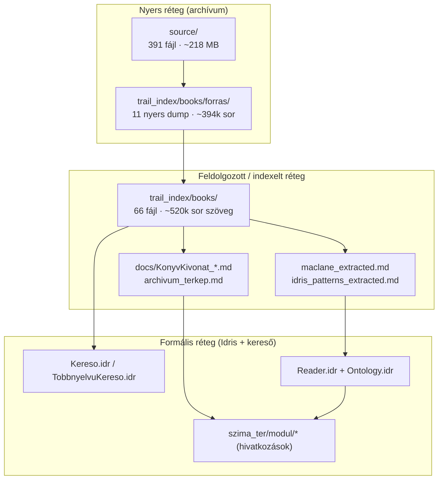
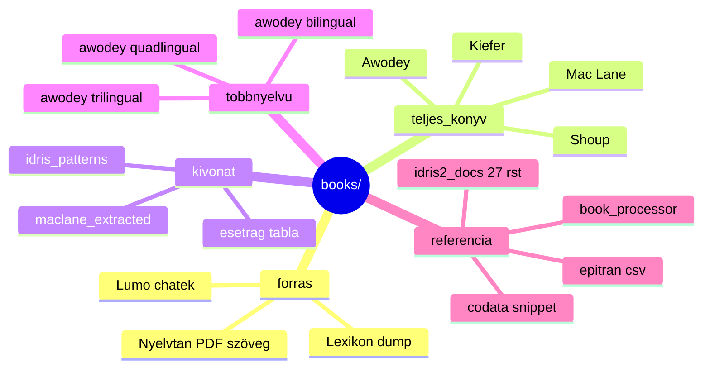
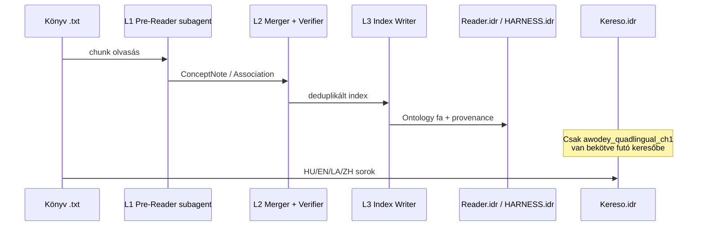
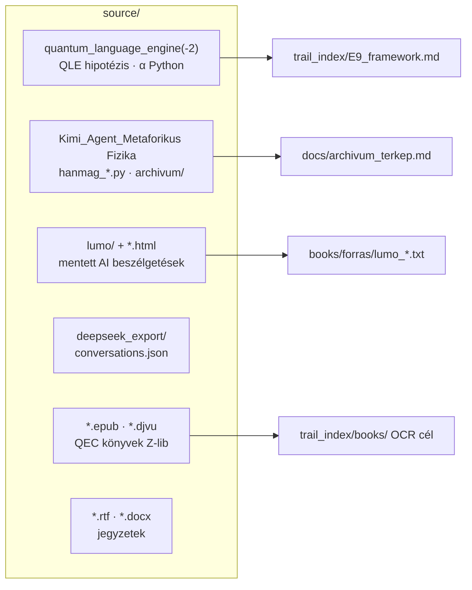
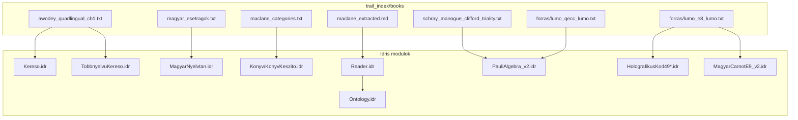

# Literatúra- és forrástérkép — Szima / opencode

**Dátum:** 2026-08-21  
**Ág:** `cursor/literature-aaa6` (vizualizációs térkép — nem a fő fejlesztési ág)  
**Cél:** Egy helyen látni, mi van a könyvekben, a `source/` archívumban, és hogyan kapcsolódnak az Idris-kódhoz.

---

## 1. Összkép — három réteg



| Réteg | Hol | Mi ez? |
|-------|-----|--------|
| **Nyers** | `source/`, `books/forras/` | Chat-exportok, Lumo HTML, EPUB/DJVU, korai Python — „attic" |
| **Feldolgozott** | `trail_index/books/`, `docs/` | OCR/txt könyvek, kétnyelvű fejezetek, kivonatok, feldolgozó spec |
| **Formális** | `osveny_index/`, `szima_ter/` | Idris típusok, kereső, olvasó-protokoll, dashboard |

**Fontos:** Nincs teljes automatikus „PDF → Idris" pipeline. A könyvek **szövegarchívum + subagent-kivonat + manuális/formális modul** úton jutnak a kódba.

---

## 2. `trail_index/books/` — a könyvtár

### 2.1 Kategóriák



### 2.2 Számláló összesítés

| Kategória | Fájlok | Sorok (kb.) | Példák |
|-----------|--------|-------------|--------|
| **forras/** (nyers) | 11 | 394 000 | `lumo_e8_lumo.txt`, `uj_magyar_lexikon.txt` |
| **Teljes könyv** (.txt) | 18 | ~120 000 | `awodey_category_theory.txt`, `maclane_categories.txt` |
| **Kivonat / tábla** | 8 | ~8 000 | `maclane_extracted.md`, `magyar_esetragok.txt` |
| **Többnyelvű** | 4 | ~12 000 | `awodey_quadlingual_ch1.txt` (589 mondat × 4 nyelv) |
| **Idris dokumentáció** | 27 .rst | ~7 700 | `theorems.rst`, `typesfuns.rst` |
| **PDF** (bináris) | 8 | — | `uj_magyar_nyelvtan.pdf`, `lisi_E8_ToE.pdf` |

### 2.3 Mi van „parse-olva"?

| Formátum | Parse jelleg | Használat |
|----------|--------------|-----------|
| `HU: / EN: / SRC:` sorok | **Strukturált** (mondatszint) | `Kereso.idr`, `TobbnyelvuKereso.idr` |
| Sima `.txt` OCR | **Nincs** — nyers szöveg | Subagent olvasás (`konyvolvaso` skill) |
| `maclane_extracted.md` | **Fogalom-szintű** YAML-szerű | Mac Lane → Idris típus javaslat |
| `idris2_docs/*.rst` | **Hivatalos doc mirror** | Fordítási referencia |
| `magyar_esetragok.txt` | **Táblázat** (18 eset) | `MagyarNyelvtan.idr` kommentek |

### 2.4 Feldolgozási pipeline (tervezett / részben él)



Specifikációk:
- `trail_index/books/book_processor.md` — ConceptNote séma
- `trail_index/hierarchical_reader.md` — L0/L1/L2/L3 architektúra

---

## 3. `source/` — archívum térképe

**Méret:** ~391 fájl, ~218 MB (főleg HTML asset bundle-ök).

### 3.1 Fő „szigetek"



### 3.2 Top-level tartalomjegyzék

| Útvonal / fájl | Típus | Tartalom (1 mondat) |
|----------------|-------|---------------------|
| `quantum_language_engine/` | Python + README | Korai „agy = Steane QEC" modell, `hypothesis_mdl_cpt.txt` |
| `quantum_language_engine-2/` | Python + skills | Ugyanaz + beágyazott research skill-ek |
| `Kimi_Agent_Metaforikus Fizika File Request/` | Python archívum | HANMAG (汉匈): ~29 `hanmag_*.py`, Carnot, E8, QFT |
| `…/archivum/` | 14 transcript | Lejeune-transformok, α-cáfolat, HanMag 8-bit spec ⭐ |
| `lumo/` | HTML + assets | E8, QECC, TheoryOf64, Magyar, Világegyetem chatek |
| `deepseek_export/` | JSON | DeepSeek beszélgetés-dump |
| `TheoryOf64.html`, `QECC-lumo.htm`, … | Webarchive | Lumo/Mistral/Accio session mentések |
| `ERROR-CORRECTING CODES (Baylis).epub` | Könyv | Klasszikus QEC irodalom (még nincs txt-ben) |
| `Quantum Error Correction … (La Guardia).epub` | Könyv | Szimmetrikus/aszimmetrikus kódok |
| `Error-Correcting Codes … (Bruen, Wehlau).djvu` | Könyv | Véges geometria + kripto |
| `Category Theory for AI.docx` | Kimi export | CT-for-AI beszélgetés |
| `gondnok-laptop/` | Üres | ProtonDrive mirror helye (laptopon) |
| `*.rtf` | Jegyzet | category theory, ébredés, gép jegyzetek |

### 3.3 HANMAG archívum — legértékesebb transcriptek

Részletes index: `docs/archivum_terkep.md`

| Fájl | Sor | Miért fontos |
|------|-----|--------------|
| `transzkript_grand_unified_1.txt` | 1 481 | **Lejeune-transform táblázat** (Landauer, Bekenstein, …) |
| `transzkript_nem_numerologia.txt` | 2 030 | α deriváció **cáfolat / hibalista** |
| `transzkript_audit_fuzio.txt` | 271 | HanMag 8-bit spec (5+3 bit/szó) |
| `transzkript_explain_category.txt` | 1 160 | Kategóriaelmélet tutorial (EN) |
| `transzkript_kategoriaelmelet_2.txt` | 787 | Ugyanaz (HU) |

---

## 4. Kapcsolatok — mi hivatkozik mire

### 4.1 Idris modulok ↔ források



### 4.2 Dokumentumok ↔ könyvek

| Dokumentum | Mit indexel |
|------------|-------------|
| `docs/KonyvKivonat_Awodey.md` | Awodey 39 struktúra |
| `docs/KonyvKivonat_MacLane.md` | Mac Lane 10 kiegészítő struktúra |
| `docs/KonyvKivonat_Idris.md` | Idris tutorial + docs |
| `docs/KonyvKivonat_Alkalmazott.md` | Lisi, Bianconi, stb. |
| `docs/Hivatkozasok_Teljes.md` | Teljes hivatkozáslista sor-számokkal |
| `docs/archivum_terkep.md` | Kimi `source/…/archivum/` |
| `trail_index/E9_framework.md` | Capstone keret + forrás-audit |

### 4.3 Skill-ek

| Skill | Útvonal | Könyv-szerep |
|-------|---------|--------------|
| **konyvolvaso** | `skills/konyvolvaso/SKILL.md` | 15-dim keresőindex Awodey/Mac Lane/Idris felett |
| **magyar-lexikon** | `skills/magyar-lexikon/SKILL.md` | Mondatszintű magyar dekompozíció |
| **konyv-keszito** | `skills/konyv-keszito/SKILL.md` | 49 struktúra LaTeX/PDF generátor |
| **boot-up** | `skills/boot-up/SKILL.md` | Session indítás, konyvolvaso betöltés |

---

## 5. Adatfolyam — Carnot metafora (kereső)

A README-ben leírt **determinisztikus magyar kereső** — ez az egyetlen *futó* könyv-felhasználás:

```
kérdés (entrópia)
  → MagyarNyelvtan.idr (18 eset, CPT)
  → Kodol.idr (E8E8KodSzo)
  → Tavolsag.idr (Hamming + Steane)
  → Kereso.idr (legközelebbi mondat)
  → válasz (energia)
```

**Jelenlegi szótár:** Awodey 1. fejezet, ~589 mondat (`awodey_bilingual_ch1.txt` / quadlingual változat).

---

## 6. Mi NINCS még (tervezett)

| Terv | Hol dokumentálva | Állapot |
|------|------------------|---------|
| `szima_ter/forras/` — bekezdés-JSON | `szima_ter/OLVASD.md`, `TERV.md` | **Üres** — nincs a repóban |
| PDF/EPUB → txt automatikus | `szima_ter/TERV.md` | EPUB a `source/`-ban, nincs OCR txt |
| Teljes Awodey/Mac Lane kereső | `Kereso.idr` | Csak 1. fejezet |
| Könyv → Idris automatikus | `book_processor.md` | Subagent manuális, nem CI |

---

## 7. Navigációs útmutató — hol kezdj?

| Ha ezt keresed… | Menj ide |
|-----------------|----------|
| Kategóriaelmélet szöveg (HU/EN) | `trail_index/books/awodey_bilingual_ch1.txt` |
| Mac Lane teljes + kivonat | `maclane_categories.txt` + `maclane_extracted.md` |
| Magyar nyelvtan (18 eset) | `magyar_esetragok.txt`, `uj_magyar_nyelvtan.txt` |
| Lumo E8/QECC beszélgetések | `books/forras/lumo_e8_lumo.txt`, `lumo_qecc_lumo.txt` |
| Korai α/G Python (legacy) | `source/quantum_language_engine-2/all_constants_exact.py` |
| Kimi gondolattörténet | `source/…/archivum/` + `docs/archivum_terkep.md` |
| QEC könyvek (bináris) | `source/*.epub`, `source/*.djvu` |
| Futó kereső kód | `osveny_index/Kereso.idr` |
| Olvasó-protokoll típusok | `trail_index/Reader.idr`, `Ontology.idr` |

---

## 8. Repo vs. fő fejlesztés

```
master / fő ág          → Idris modulok, bizonyítások, dashboard
cursor/literature-aaa6  → ez a térkép (navigáció, nem kód-változás)
source/                 → archívum (ne törölni, AGENTS §20)
trail_index/books/      → olvasható szövegkorpusz
```

**Szabály emlékeztető:** AGENTS §11 — a fő ügynök nem olvassa a könyveket; subagent / skill (`konyvolvaso`). AGENTS §3 — új számítás Idrisben, nem kézi Python.

---

## 9. Következő lépések (javaslat, nem commitelve)

1. **EPUB → txt** — Baylis / La Guardia QEC könyvek OCR a `books/forras/`-ba  
2. **Awodey 2. fejezet** — bilingual formátum, `Kereso` szótár bővítés  
3. **forras index JSON** — gépi navigáció (fájlnév, sor, kategória, bekötött modul)  
4. **Provenance lánc** — `Provenance.idr` mezők kitöltése minden kivonatnál  

---

*Generálva: Cloud Agent literatúra-feltárás, 2026-08-21.*
