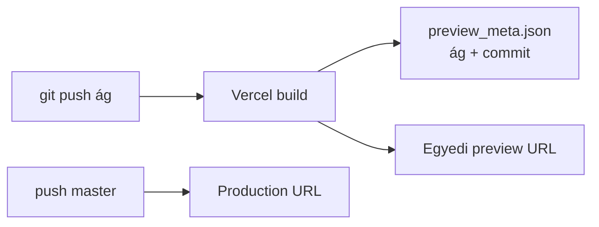

# Ág-specifikus dokumentáció — Vercel preview

**Cél:** Minden git ág saját weboldalt kap; a `master` a production URL, a többi ág automatikus preview.

---

## Miért Vercel?

| Szolgáltatás | Ág-specifikus oldal | Beállítás |
|--------------|---------------------|-----------|
| **Vercel** | ✅ Automatikus preview minden push-ra | Import repo, root=`docs` |
| **Cloudflare Pages** | ✅ Ugyanígy preview branch-ekre | Connect Git, output=`docs` |
| **GitHub Pages** | ⚠️ Egy site / repo (külön workflow kell áganként) | Bonyolultabb |

Vercel **ingyenes tieren** is ad branch preview URL-t, pl.:

```
https://szima-git-cursor-literature-aaa6-jhegedus42.vercel.app/literatura.html
```

Production (`master` merge után):

```
https://szima.vercel.app/literatura.html
```

(A pontos aldomain a Vercel projekt nevedtől függ.)

---

## Egyszeri beállítás (5 perc)

### 1. Vercel projekt

1. [vercel.com/new](https://vercel.com/new) → **Import** → `jhegedus42/Szima`
2. **Root Directory:** hagyd üresen (a gyökérben van `vercel.json`)
3. **Framework Preset:** Other
4. **Build Command:** `bash docs/scripts/vercel-build.sh` (a `vercel.json` már megadja)
5. **Output Directory:** `docs`
6. **Production Branch:** `master`

Deploy.

### 2. Mi történik push-ra?



- **`master`** → production domain + zöld banner (`kornyezet: production`)
- **Bármely más ág** → `*-git-<ág-nev>-*.vercel.app` + kék banner
- **Pull request** → preview URL a PR kommentben (Vercel bot)

### 3. Branch banner

Minden `docs/*.html` oldal alján megjelenik:

- ág neve (pl. `cursor/literature-aaa6`)
- commit rövid hash
- link a GitHub `docs/` mappára az adott ágon

Meta JSON: `docs/adatok/preview_meta.json` (build időben generálva, gitignore-olható ha akarod — jelenleg commitoljuk a build outputot csak Vercel-en, lokálisan generálódik).

---

## Munkafolyamat — ág-specifikus docs

```bash
# Új docs ág
git checkout -b cursor/my-feature-docs-aaa6
# Szerkeszd docs/ — pl. új oldal, literatura.html, stb.
git add docs/ && git commit -m "docs: my feature"
git push -u origin cursor/my-feature-docs-aaa6
# → Vercel automatikusan buildel → preview URL
```

Minden ág **saját `docs/` tartalmát** szolgálja ki — nincs kereszt-szennyezés.

---

## Repo fájlok

| Fájl | Szerep |
|------|--------|
| `/vercel.json` | Build parancs, output=`docs` |
| `docs/scripts/vercel-build.sh` | Ág/commit meta + banner inject |
| `docs/_preview/banner.css` | Generált (build) |
| `docs/_preview/banner.js` | Generált (build) |
| `docs/adatok/preview_meta.json` | Generált (build) — ág azonosító |
| `docs/literatura.html` | Literatúra térkép |
| `docs/vercel.json` | Legacy (docs-root import esetén); preferáld a gyökér `vercel.json`-t |

---

## GitHub Pages vs Vercel (ebben a repóban)

| | GitHub Pages | Vercel preview |
|--|--------------|----------------|
| Production | `jhegedus42.github.io/Szima/` | `*.vercel.app` |
| Ág preview | ❌ nem automatikus | ✅ minden ág |
| Workflow | `.github/workflows/deploy-docs-pages.yml` | Vercel dashboard |
| **Ajánlás** | Egy stabil production mirror | **Ág-specifikus docs** |

Használhatod **mindkettőt**: Pages = nyilvános production, Vercel = branch lab.

---

## Cloudflare Pages (alternatíva)

Ugyanaz az elv:

1. Pages → Connect Git → Szima
2. Build command: `bash docs/scripts/vercel-build.sh`
3. Output: `docs`
4. Preview branches: **All non-production branches**

Preview URL: `https://<hash>.szima.pages.dev/literatura.html`

---

## MCP?

Jelenleg **nincs Vercel/Cloudflare MCP** a Cloud Agent környezetben. A deploy a Vercel/Cloudflare dashboard + git push. A `cursor-subscriptions` MCP **GitHub CI-t** tud figyelni, ha Vercel GitHub check-ként jelzi a deploy-t.

---

*Ág: `cursor/literature-aaa6` · 2026-08-21*
